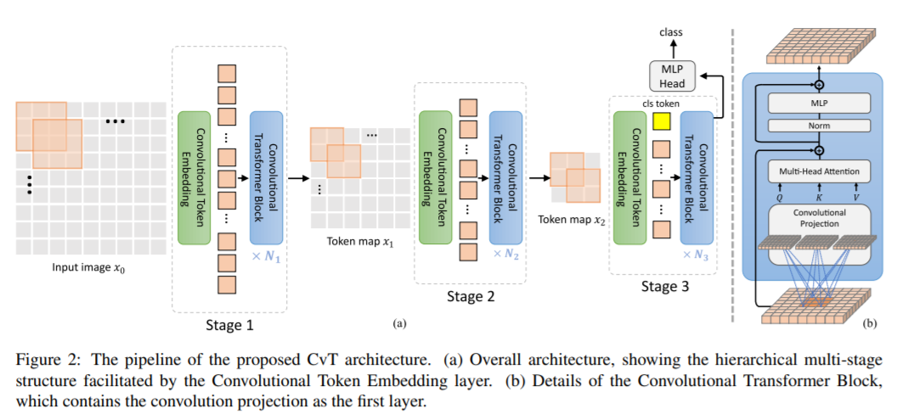

# CvT: Introducing Convolutions to Vision Transformers
Pytorch implementation of [CvT: Introducing Convolutions to Vision Transformers](https://arxiv.org/abs/2103.15808) , for official repo please visit [here](https://github.com/microsoft/CvT).


## Usage:
```python
img = torch.ones([1, 3, 224, 224])

model = CvT(224, 3, 1000)

parameters = filter(lambda p: p.requires_grad, model.parameters())
parameters = sum([np.prod(p.size()) for p in parameters]) / 1_000_000
print('Trainable Parameters: %.3fM' % parameters)

out = model(img)

print("Shape of out :", out.shape)  # [B, num_classes]
```
## Citation:
```
@misc{wu2021cvt,
      title={CvT: Introducing Convolutions to Vision Transformers}, 
      author={Haiping Wu and Bin Xiao and Noel Codella and Mengchen Liu and Xiyang Dai and Lu Yuan and Lei Zhang},
      year={2021},
      eprint={2103.15808},
      archivePrefix={arXiv},
      primaryClass={cs.CV}
}
```
## Acknowledgement:
* Base ViT code is borrowed from [@lucidrains](https://github.com/lucidrains) repo : https://github.com/lucidrains/vit-pytorch
